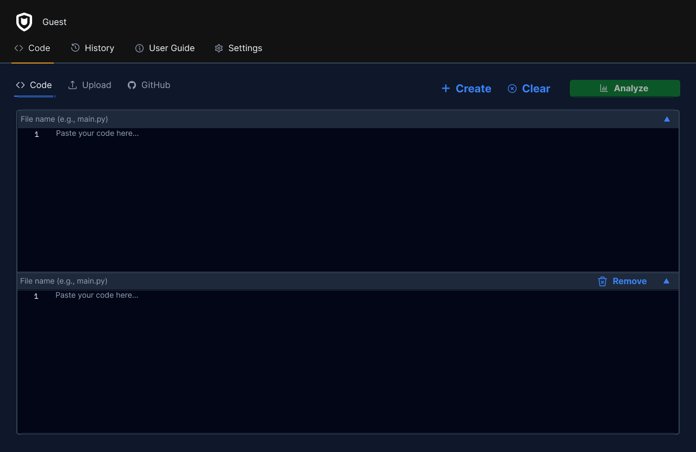
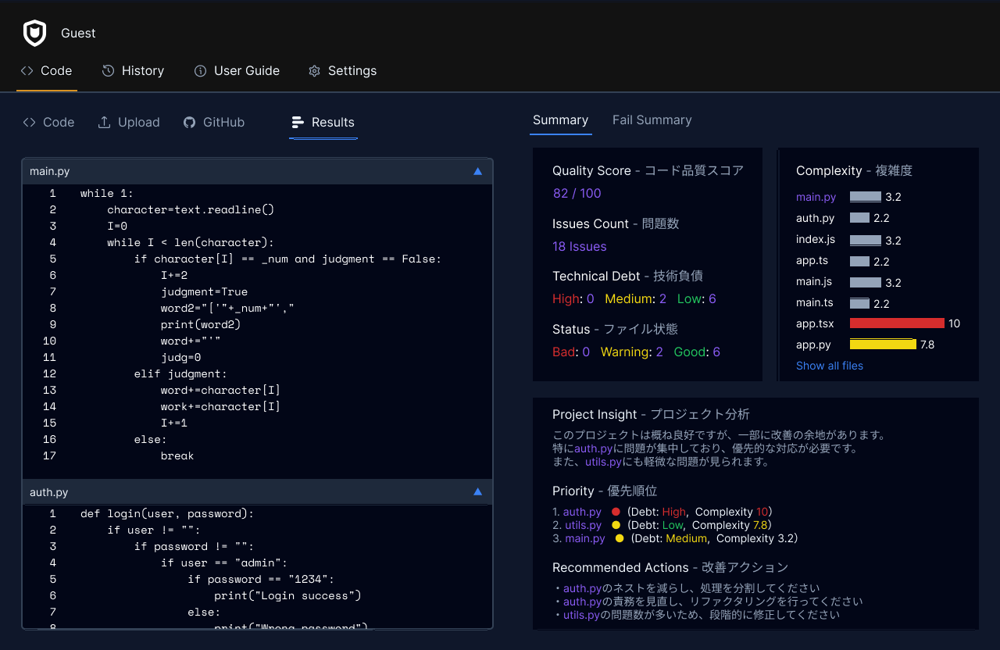

# AI Code Review SaaS

Pythonコードを解析し、品質スコア・技術的負債・複雑度・改善点を可視化するWebアプリケーションです。レビュー担当者へコードを渡す前に一定水準まで品質を高めることで、レビュー負担の軽減を目指して個人開発しました。

## デモ

- フロントエンド: https://ai-code-review-saas.vercel.app
- バックエンド (API): https://ai-code-review-saas.onrender.com

※ バックエンドは無料プランで稼働しているため、初回アクセス時は起動に30〜60秒かかる場合があります。

## 画面イメージ

コード入力画面



解析結果画面



※ 掲載画像は開発時のものです。最新の画面はデモURLからご確認いただけます。

## 主な機能

- 品質スコアの算出: コードを100点満点で評価し、ダッシュボードに表示
- 技術的負債の判定: 「直しやすさ × 量」の観点で High / Medium / Low を判定
- 複雑度の算出: ネストの深さを考慮して複雑度を計算し、警告レベルを色で表示
- 問題点の検出と分類: 検出した問題を Security / Bug / Structure / Readability などのカテゴリに分類し、深刻度を色で可視化
- 改善提案・リファクタリング: 検出した問題に対する改善案や、Before / After のリファクタリング例を提示

## 技術スタック

フロントエンド
- Next.js (App Router)
- React / TypeScript
- Tailwind CSS

バックエンド
- Python
- FastAPI

インフラ / デプロイ
- Vercel (フロントエンド)
- Render (バックエンド)

## システム構成

```
[ ユーザー ]
     |  コードを入力
     v
[ フロントエンド (Next.js / Vercel) ]
     |  REST API リクエスト
     v
[ バックエンド (FastAPI / Render) ]
     |  解析ロジックで処理
     v
[ 解析結果 (スコア・問題点・複雑度) を返却 ]
     |
     v
[ ダッシュボードに可視化 ]
```

フロントエンドとバックエンドを分離した構成で、フロントから送られたコードをバックエンドのAPIが解析し、結果をJSONで返してダッシュボードに表示します。

## こだわった点・工夫した点

実務を意識した評価ロジック
単に問題を列挙するのではなく、「直しやすさ × 量」で技術的負債を判定するなど、レビュー担当者が実際に役立つ評価設計を自分で考えて実装しました。

複雑度の重み付け
ネストの深さに応じて複雑度に重みを付け、深い階層ほど複雑とみなすことで、実態に近い複雑度を算出できるようにしました。

フロント / バック分離デプロイ
フロントエンドとバックエンドを別サービスにデプロイする過程で発生した CORS エラーや環境変数の設定を、一つずつ原因を切り分けて解決し、URLから誰でも実際に動かせる状態まで仕上げました。

## ローカルでの起動方法

バックエンド
```bash
cd backend
pip install -r requirements.txt
uvicorn main:app --reload --port 8000
```

フロントエンド
```bash
cd frontend
npm install
npm run dev
```

- フロントエンド: http://localhost:3000
- バックエンド (API ドキュメント): http://localhost:8000/docs

## 対応言語

現在は Python を解析対象としています。言語ごとにコメント記法やネスト構造の表現が異なるため、まず1つの言語で解析精度を担保することを優先しました。多言語対応は、言語ごとに構文解析を分岐させる設計で拡張可能と考えています。

## 今後の展望

- 解析結果のデータをもとに、AIが次に取るべき改善アクションを提案する機能の追加
- 対応言語の拡張 (JavaScript / TypeScript など)
