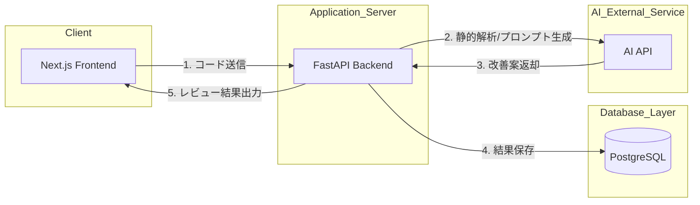

# システム構成図

## システム概要
本プロジェクトは、コードレビュー及びAIを活用したリファクタリング支援SaaSです。
ユーザーが入力したコードに対し、アルゴリズムの観点から問題点を抽出し、AIが具体的な改善アクション及びリファクタリング案と問題点を可視化したダッシュボード形式で提示します。

## システムアーキテクチャ図

```mermaid
graph LR
    subgraph Client
        A[Next.js Frontend]
    end
    subgraph Application_Server
        B[FastAPI Backend]
    end
    subgraph Database_Layer
        C[(PostgreSQL)]
    end
    subgraph AI_External_Service
        D[AI API]
    end

    A -->|1. コード送信| B
    B -->|2. 静的解析/プロンプト生成| D
    D -->|3. 改善案返却| B
    B -->|4. 結果保存| C
    B -->|5. レビュー結果出力| A
```