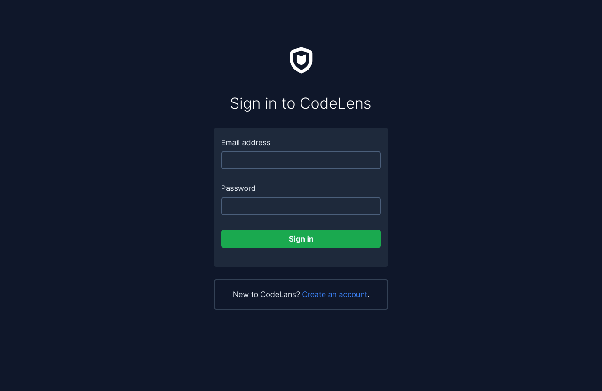
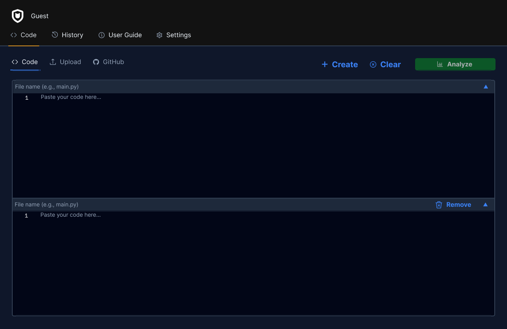
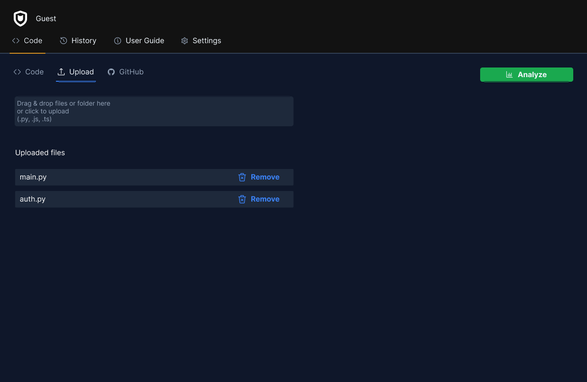
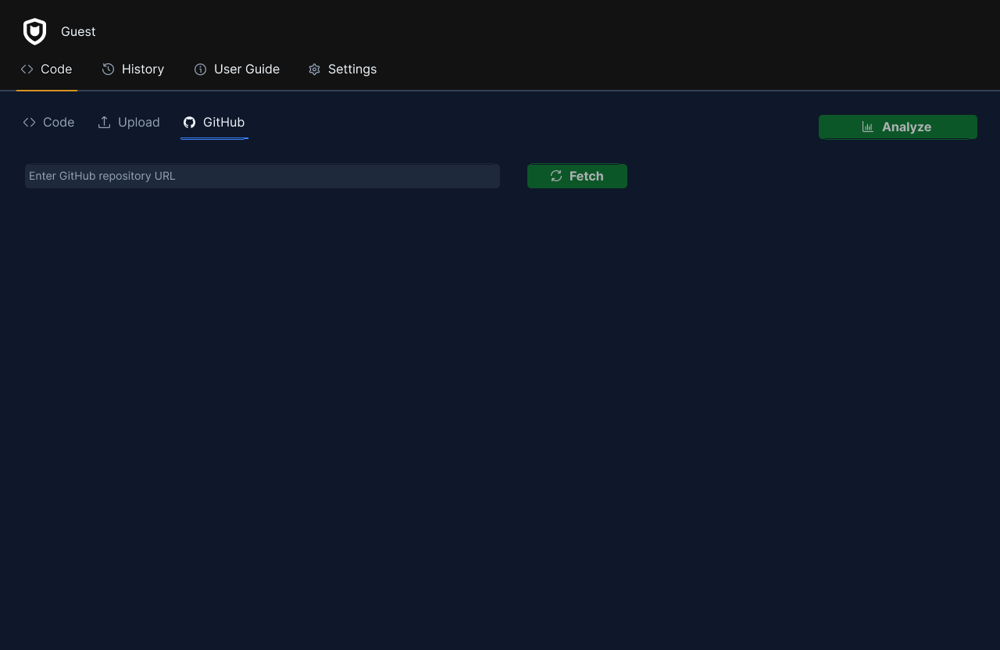
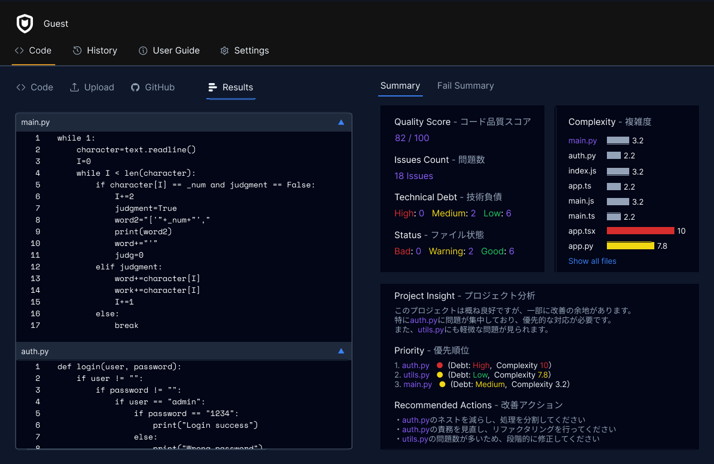
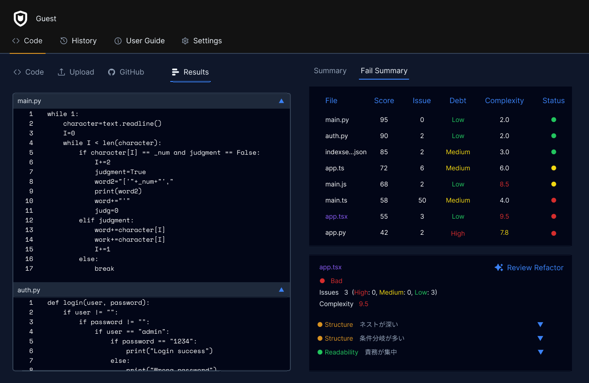

# 画面設計

## 

ログイン画面
-メールアドレス
-パスワード

## 

コード入力画面
-コピー＆ペースト

## 

アップロード画面
-ファイルをアップロード

## 

GitHubリポジトリ入力画面
-リポジトリを入力する

## 

解析結果全体概要画面
-入力コード
-スコア
-問題数
-技術負債
-解析ファイル数
-複雑度
-分析結果

## 

-入力コード
-スコア
-問題数
-技術負債
-解析ファイル数
-複雑度
-分析結果
-リファクタリング機能